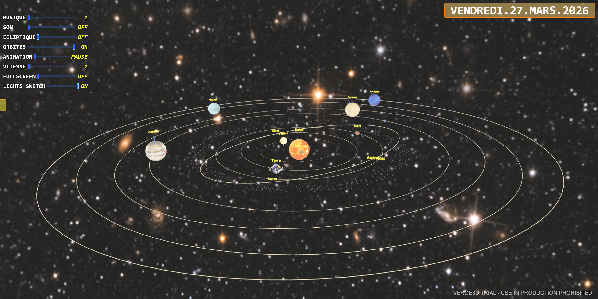

# SYSTEME_SOLAIRE_VERGE3D

## 📸 Aperçu



# 🌌 Système Solaire 3D – Verge3D + IMCCE / Miriade

Application web interactive en **3D** représentant le **système solaire** réalisée avec **Verge3D**, affichant les positions des planètes à une date donnée grâce au service d’éphémérides **IMCCE / Miriade**.

Ce projet permet de visualiser en temps réel ou à une date choisie :

- ☀️ Soleil
- ☿ Mercure
- ♀ Vénus
- 🌍 Terre
- 🌙 Lune
- ♂ Mars
- ☄️ Ceinture d’astéroïdes + Cérès
- ♃ Jupiter
- ♄ Saturne
- ♅ Uranus
- ♆ Neptune
- (optionnel selon version : Pluto)

---

## ✨ Fonctionnalités

- Représentation 3D du système solaire dans le navigateur
- Choix d’une **date précise**
- Récupération des **positions astronomiques réelles** via l’API **IMCCE / Miriade**
- Positionnement dynamique des planètes sur leurs orbites
- Affichage des **orbites**
- Affichage des **axes de rotation**
- **Billboards / labels** indiquant le nom des planètes
- Animation des rotations :
  - rotation sur elles-mêmes
  - révolution sur orbite
- Réglage de la **vitesse d’animation**
- Gestion de l’**audio / musique**
- Mode **plein écran**
- Interface utilisateur avec sliders et boutons de contrôle

---

## 🛠️ Technologies utilisées

- **Verge3D**
- **JavaScript**
- **HTML / CSS**
- **API Fetch**
- **IMCCE / Miriade ephemcc API**

---

## 📁 Structure du projet

```text
T:.
|   favicon.ico
|   favicon1.ico
|   systeme_solaire.bin
|   systeme_solaire.bin.xz
|   systeme_solaire.css
|   systeme_solaire.gltf
|   systeme_solaire.gltf.xz
|   systeme_solaire.html
|   systeme_solaire.js
|   systeme_solaire_iframe.html
|   v3d.js
|
+---sons
|       Robot_blip_2-Marianne_Gagnon-299056732.mp3
|
\---textures
        2k_jupiter.jpg
        2k_mars.jpg
        2k_mercury.jpg
        2k_moon.jpg
        2k_neptune.jpg
        2k_saturn.jpg
        2k_stars.jpg
        2k_sun.jpg
        2k_uranus.jpg
        2k_venus_atmosphere.jpg
        3215-bump.jpg
        3215.jpg
        asteroides.png
        Axe.png
        Axe1.png
        ceres.jpg
        ceres.png
        ceres_bump_map.jpg
        jupiter.png
        land_ocean_ice_cloud_2048.jpg
        lune.png
        mars.png
        mercure.png
        neptune.png
        saturne.png
        saturn_Saturn_Rings_1__John_van_Vliet.jpg
        soleil.png
        star_sky_hdri_spherical_map_by_kirriaa.jpg
        terre.png
        uranus.png
        venus.png
```
